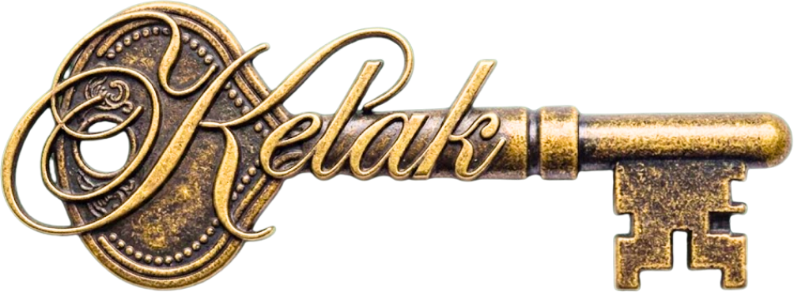

# Kelak — editing guide

*Kelak* means **someday** in Indonesian. This site lets people lock a message, photo, video or voice note on BOT Chain, openable only by the intended wallet once the chosen date arrives.

Everything lives in four files:

| File | What's in it |
| --- | --- |
| `public/index.html` | All the words and page structure |
| `public/style.css` | All the styling (colours, fonts, spacing) |
| `public/script.js` | Wallet connection + smart-contract calls |
| `README.md` | This guide |

Open the site at `/index.html`.

---

## 🎨 Colours

All colours live in **one place**: the `:root` block at the very top of `public/style.css` (lines 5–13). Change a hex value there and it updates everywhere on the site automatically.

```css
--dark-walnut:  #622D12;  /* page background            */
--dark-spruce:  #25401F;  /* navbar + hero background   */
--olive-wood:   #885F38;  /* card surfaces, borders     */
--palm-leaf:    #8C946B;  /* soft secondary text        */
--saddle-brown: #8F481B;  /* primary buttons            */
--parchment:    #F3E9D8;  /* cream text on dark         */
--brass:        #C9A227;  /* gold linework & flourishes */
```

Fonts are just below, in the same block (`--font-display`, `--font-script`, `--font-body`). If you swap a font name, also update the Google Fonts `<link>` near the top of `index.html`.

## 🔑 Logo

The ornate brass key wordmark lives at **`public/assets/logo.png`** and is referenced in `index.html` inside the navbar:

```html

```

Replace that file with the same filename and the new logo appears instantly — no code change. (If the file is ever missing, a dashed box reading "LOGO HERE" shows in its place.) Its size is set by `.logo-slot` in `style.css`.

## 🖼️ Images

| Where | File | Line in `index.html` |
| --- | --- | --- |
| Navbar logo | `public/assets/logo.png` | the `` in the `.brand` link |
| "Make Vault" button plaque | `public/assets/cta-make-vault.png` | the `<a class="cta-plaque">` in `<div class="hero-actions">` |
| Hero vault wall | `public/assets/vault-wall.jpg` | the `` inside `<div class="hero-art">` |

Put replacements in `public/assets/` using the same filenames and they swap in instantly. The hero image looks best portrait-ish, around 1024×1280.

## ✍️ Text content

The headline, subheadline, button labels, card copy and the About paragraphs are all plain text in `public/index.html`. Edit them directly — they're safe. Look for:

- `<h1>Some words are meant for the future.</h1>`
- the `<p class="lede">` right below it
- the secondary hero button: `📖 Learn More` (the primary button is the "Make Vault" plaque image — change it by swapping `public/assets/cta-make-vault.png`; its size is the `width` on `.cta-plaque` in `style.css`)
- the `How Kelak Works`, `Why Blockchain?` and `About Kelak` sections further down

## ⛓️ Contract address & ABI — the one required change

At the very top of `public/script.js`:

```js
const CONTRACT_ADDRESS = "0xAee4Bd54bD01CaF21529dB44a7B0CE782aDcE35d"; // ⚠️ TESTNET
const CONTRACT_ABI = [ … ];
```

These are **testnet** values. After the final mainnet deployment you **must** replace the address (and the ABI, if the contract changed) with the mainnet ones. This is the only functional edit required before submission — everything else above is cosmetic.

## 🚫 What not to touch

In `public/script.js`, everything below the line marked

```
/* ============ FUNCTIONAL CODE — handle with care ============ */
```

is the wallet connection and the contract calls (create, unlock, look up, dashboard). Breaking it breaks the whole app, so only edit it if you know what it does. Error messages shown to visitors are written in plain, warm language in the `friendlyError` function — that text is safe to reword.
